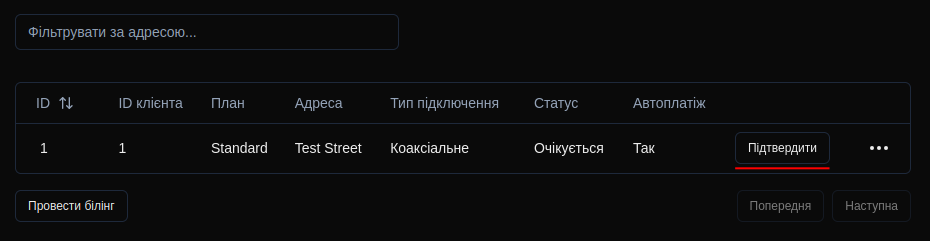

# SpectraLink - Fullstack ISP Web App


A fullstack web application simulating an internet service provider, built as a portfolio project. The platform allows users to register, manage internet connections, handle billing and access admin-level operations. A production-ready backend system featuring secure auth, Redis caching, transactional SQL, and containerized deployment - built for scalability and modern DevOps workflows.


---

## ✨ Features

* **User Authentication & Authorization**

	* User registration with server-side validation (`Zod`), collision checks and hashing (`bcryptjs`)
  * Secure credential-based login with [`NextAuth.js`](https://next-auth.js.org/) and JWT strategy
  * Role-based access control (`User`, `Admin`) enforced via custom `middleware.js`

* **Service Connection System**

  * Users can submit new connection requests with a chosen plan, address, and connection type
  * Connections become available for activation after approval by an admin in the control panel

* **Client Dashboard**

  * Full control over client's subscriptions: connection activation, plan change, auto-renewal toggle
  * Activation with prorated cost based on remaining days in the month, wrapped in a secure SQL transaction
  * Balance top-ups and connection activations are automatically logged in the Transactions table

* **Recurring Billing System**

  * Automated billing at the start of each month for active connections with auto-renewal enabled, implemented via MySQL Events
  * Manual event trigger available in the admin panel

* **Admin Panel**

  * Full CRUD for Users, Plans, and Connections
  * Traffic plan and connection type usage statistics
  * Safe updates with role-gated access control

* **DevOps & Infrastructure**

  * **Docker Compose:** Fully containerized stack (Next.js + MySQL + Redis) that can be spun up with one command
  * **Redis:** Traffic plans caching with TTL and cache invalidation when plans are created or edited
  * **GitHub Actions:** Automated Docker image build and upload to GitHub Container Registry on each push


---

## 🗃️ Database Schema

### ER Diagram


### Tables Overview

| Table          | Description                                                                 |
|----------------|-----------------------------------------------------------------------------|
| **Users**      | Stores user accounts with credentials, balance, and assigned role        |
| **Plans**      | Contains available traffic plans with pricing and specifications           |
| **Connections**| Tracks service subscriptions with status and billing preferences         |
| **Transactions**| Logs all financial transactions including top-ups and service payments      |

### Key Relationships
- One-to-Many: `Users` → `Connections` (A user can have multiple connections)
- One-to-Many: `Plans` → `Connections` (A plan can be used by multiple connections)
- One-to-Many: `Users` → `Transactions` (A user can have multiple transactions)


## 🛠️ Prerequisites

### 📦 Docker Deployment

- Docker
- Docker Compose

### 💻 Local Deployment

- Node.js >= 18
- npm or yarn
- MySQL 8.0
- Redis
---
## ⚙️ Installation & Usage

### 📦 Docker Deployment (Recommended)

#### 1. Clone the repository

```bash
git clone https://github.com/LetMeCookPlz/SpectraLink
cd SpectraLink
```

#### 2. Create and configure the `.env` file
Run this command twice to generate a random NextAuth secret and MySQL password (Linux/macOS/WSL):
```bash
openssl rand -base64 32
```
Then create `.env` file in project root:
```ini
MYSQL_PASSWORD=your_generated_password_here
NEXTAUTH_SECRET=your_generated_secret_here
```

#### 3. Start the app

```bash
docker-compose up
```

#### 4. Access the frontend

[``http://localhost:3000``](http://localhost:3000)

---

### 💻 Local Deployment (Manual)

#### 1. Clone the repository

```bash
git clone https://github.com/LetMeCookPlz/SpectraLink
cd SpectraLink
```

#### 2. Install dependencies

```bash
npm install
# or
yarn install
```

#### 3. Setup database

* Create a `spectralink` MySQL database
* Run [`init.sql`](./init.sql)

#### 4. Start Redis

Ensure Redis server is running locally on port 6379.

#### 5. Create and configure the `.env.local` file
Run this command to generate a random NextAuth secret (Linux/macOS/WSL):
```bash
openssl rand -base64 32
```
Then create `.env.local` file in project root:
```ini
MYSQL_HOST=localhost
MYSQL_USER=root
MYSQL_PASSWORD=your_mysql_password
MYSQL_DB=spectralink
REDIS_HOST=localhost
NEXTAUTH_URL=http://localhost:3000
NEXTAUTH_SECRET=your_generated_secret_here
```

#### 6. Run the app

```bash
npm run dev
# or
yarn dev
```

#### 7. Access the frontend
[``http://localhost:3000``](http://localhost:3000)

---

## 🧪 Testing the App

1. **Create an Account**   
Visit `/signup` to create a user account


2. **Log In**   
Access your account via `/login`


3. **Browse Plans**   
Navigate to `/plans` to explore the available options


4. **Request Connection**   
Select a plan and submit the necessary details


---

### Necessary Admin Actions
5. Log out of your account and enter the default admin credentials (Login: `admin@mail.com`, Password: `12345`)

6. Visit `/admin/connections` and approve the connection request you submitted



---

7. After approval, log back into your account and head over to `/dashboard`


8. **Balance Top-up**   
 Select the sum you wish to deposit to your balance using the slider and enter mock credit card info (purely cosmetic - does not get validated)


9. **Activate Service**   
Finally, pay the prorated price for this month to activate your connection.

10. **Done!** 🎉   
Enjoy your (fictional) internet connection and explore the remaining features at your own pace.